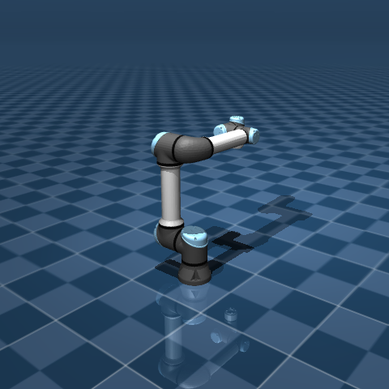
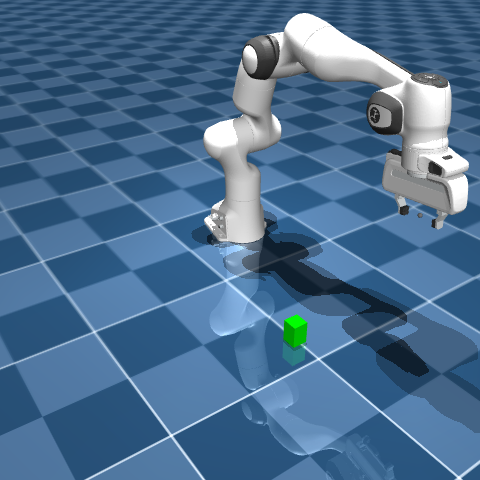
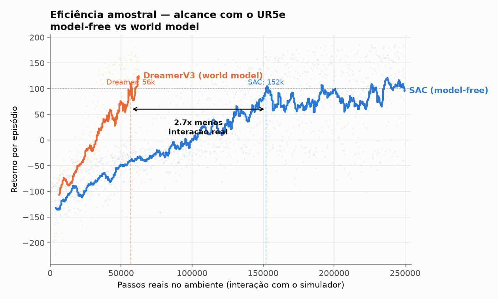
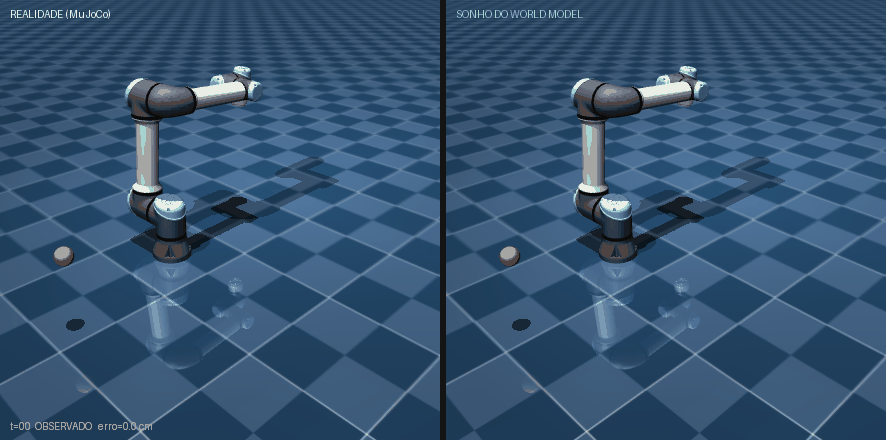
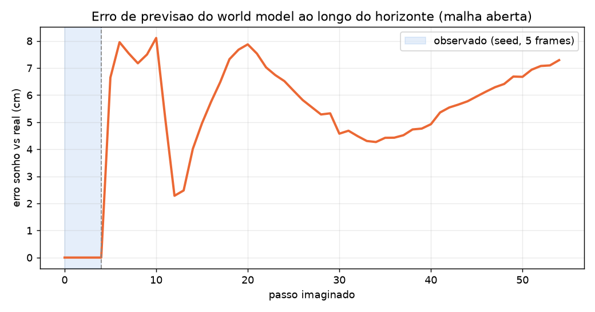
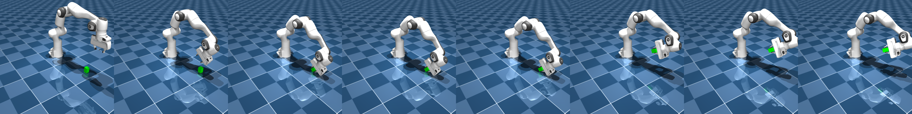

# world-model-arm

> **Trabalho em andamento.** Este repositório faz parte de um TCC em
> desenvolvimento. O código, os resultados e a documentação ainda estão
> evoluindo e podem mudar — algumas tarefas (como a preensão) seguem em aberto.

Comparação entre aprendizado por reforço **model-free** (SAC) e **baseado em
modelo de mundo** (DreamerV3) no controle de braços robóticos simulados, com
foco em **eficiência amostral** — quantas interações reais com o ambiente cada
método precisa para aprender uma tarefa.

O argumento central: um modelo de mundo aprende a dinâmica do robô e treina a
política **na imaginação**, extraindo muito mais aprendizado de cada interação
real. Isso importa porque, em um robô físico, cada tentativa custa tempo,
desgaste e risco — a interação, não a computação, é o recurso caro.

Robôs: **UR5e** (6 DOF) para a tarefa de alcance e **Franka Emika Panda**
(7 DOF + garra) para a tarefa de preensão, ambos do
[MuJoCo Menagerie](https://github.com/google-deepmind/mujoco_menagerie).
World model: [DreamerV3 (NM512/dreamerv3-torch)](https://github.com/NM512/dreamerv3-torch).
Baseline: SAC do [Stable-Baselines3](https://github.com/DLR-RM/stable-baselines3).

<p align="center">
  
  
</p>

---

## Resultado principal: eficiência amostral

Na tarefa de alcance com o UR5e, o world model atinge um dado nível de
desempenho com **cerca de 2,7× menos interação real** com o ambiente que o
baseline model-free. O fator é estável ao limiar escolhido (2,68–2,69× para
retornos-alvo entre 60 e 100).



| Método | Passos reais para atingir retorno 100 | Observação |
|---|---|---|
| SAC (model-free) | ~152 mil | treinado até ~250 mil passos |
| DreamerV3 (world model) | ~57 mil | treino interrompido em ~62 mil passos |

> **Ressalva importante.** Esta é **uma única execução (1 seed) por método**, e as
> duas curvas foram treinadas com orçamentos diferentes: o SAC até ~250 mil passos,
> o Dreamer até ~62 mil. Nos últimos 100 episódios de cada curva, o retorno médio é
> SAC ≈ 100 (±75) e Dreamer ≈ 77 (±84) — e a curva do Dreamer **ainda estava
> subindo** quando foi interrompida. Portanto **a paridade de desempenho final não
> está demonstrada**; o resultado sólido aqui é a **eficiência amostral** (a curva
> azul alcança qualquer nível antes da laranja), não o teto final. Ver "Limitações".

**Por quê (hipótese).** O SAC só aprende com as transições que realmente
experimentou. O Dreamer treina a política dentro de rollouts **imaginados** pelo
modelo de mundo (sem tocar no simulador), com supervisão densa (reconstruir a
observação, prever recompensa e continuidade) e gradientes analíticos através da
dinâmica aprendida. Uma ressalva honesta: o ganho medido **não isola** o efeito do
modelo de mundo da **razão update-para-dado (UTD)** — este Dreamer faz muito mais
atualizações por passo real do que este SAC. Parte do 2,7× pode vir do UTD, não só
da imaginação; um SAC com UTD equiparado seria necessário para separar os dois
(ver "Limitações").

---

## Ver o modelo de mundo funcionando

Alcançar um ponto não demonstra o modelo de mundo por si só — o que o distingue
é a capacidade de **simular o futuro**. O experimento abaixo semeia o modelo com
5 frames reais e, a partir daí, o deixa **imaginar livre** (malha aberta, sem o
simulador), usando as mesmas ações. À esquerda, o mundo real (MuJoCo); à direita,
o que o modelo imagina.



A curva de erro compara, a cada passo, a pose imaginada com a real. Os
**primeiros 5 passos são o "seed"** (zona em azul): ali o sonho é inicializado com
os frames reais, então o erro é ~0 **por construção** — isso não é mérito do
modelo. A partir do passo 5 o modelo imagina em malha aberta, e aí sim o número é
informativo: o erro cresce mas fica **limitado (poucos centímetros, ~6 cm) e não
diverge** ao longo de dezenas de passos, degradando além do horizonte de treino
(~15 passos) — o que justifica por que o Dreamer imagina em horizontes curtos e
re-ancora na realidade.



> Ressalvas desta figura (ver "Limitações"): é **uma única trajetória** de uma
> política de alcance já convergida (que vai ao alvo e para), então prever um ponto
> quase fixo é relativamente fácil; faltam baselines triviais (congelar a última
> pose; velocidade constante) e um teste com ações aleatórias. E o número honesto
> para a zona de seed seria o **erro de reconstrução** (decodificar o latente
> posterior e comparar), ainda não plotado.

Políticas aprendidas executando a tarefa de alcance:

<p align="center">
  
  
</p>

*(esquerda: SAC; direita: política treinada pelo world model)*

---

## Tarefa difícil: preensão (grasping)

A tarefa de **pegar um objeto** com o Franka Panda é um problema de exploração
difícil e recompensa quase esparsa: para receber a recompensa de levantar, é
preciso alinhar, fechar a garra e erguer numa sequência precisa que a exploração
aleatória quase nunca descobre. Nas condições testadas aqui, o RL **model-free**
não resolveu a tarefa:

- **SAC do zero:** 600 mil passos, **0 sucessos**. A política estaciona em "se
  aproximar do objeto" e nunca descobre a preensão.
- **Com currículo + ajuste de recompensa:** continua sem convergir (sucessivos
  ótimos locais).

A física da tarefa é válida — um controlador por **cinemática inversa (DLS)**
pega e levanta o cubo de forma confiável:



Importante: até aqui só o **model-free (SAC)** foi testado na preensão, com **uma
seed e sem varredura de hiperparâmetros** — então isto **não** é uma afirmação
geral sobre "RL". Treinar o **Dreamer na preensão** (que notoriamente também sofre
com recompensa esparsa em manipulação) é o experimento que falta, e está planejado;
mesmo um Dreamer que falhe ali seria um resultado mais forte que o atual.

Conclusão parcial, alinhada à literatura: preensão do zero costuma exigir mais do
que ajuste de recompensa — **demonstrações** (imitação para semear a política),
HER, ou currículos mais fortes. O controlador por IK deste repositório serve
justamente como **demonstrador** para esse próximo passo.

---

## Estrutura do repositório

```
envs/                 ambientes Gymnasium (MuJoCo)
  ur5e_reach.py         UR5e: alcançar um alvo (obs 21-d, ação 6-d)
  panda_grasp.py        Franka: pegar um cubo (obs 24-d, ação 8-d, currículo)
  assets/*.xml          cenas (incluem os modelos do Menagerie)
dreamer/              integração com o DreamerV3 (ver dreamer/README.md)
  envs_ur5e.py          env do UR5e para o Dreamer (estado e pixels)
  configs_ur5e.yaml     preset ur5e_proprio
train/                treino model-free (SAC)
  train_sac_ur5e.py     baseline no alcance, loga retorno x passos reais
  train_sac_grasp.py    SAC na preensão (loga taxa de sucesso)
eval/                 avaliação e figuras
  plot_sample_efficiency.py   gráfico SAC vs Dreamer
  dream_vs_real.py            sonho vs realidade (malha aberta) + curva de erro
  rollout_sac.py              render da política SAC
  scripted_grasp.py           preensão por cinemática inversa (demonstrador)
viewers/              visualizador web ao vivo (real vs imaginação)
figures/              figuras usadas neste README
results/              curvas de treino (para reproduzir o gráfico)
setup_models.py       baixa Menagerie + dreamerv3-torch e aplica a integração
```

---

## Como reproduzir

Pré-requisitos: Python 3.10+, `git`, e PyTorch instalado para a sua plataforma
(CPU, CUDA ou ROCm — ver `requirements.txt`).

```bash
pip install -r requirements.txt
python setup_models.py          # clona os modelos e o DreamerV3, aplica a integração
```

**Baseline model-free (SAC) no alcance:**

```bash
python train/train_sac_ur5e.py          # salva results/sac_ur5e.jsonl e results/sac_ur5e.zip
```

**World model (DreamerV3) no alcance:**

```bash
# Windows PowerShell: $env:WMA_ENVS="$PWD\envs"   |   Linux/Mac: export WMA_ENVS=$PWD/envs
cd dreamerv3-torch
python dreamer.py --configs ur5e_proprio --logdir logdir/ur5e_state --steps 150000
```

**Gerar as figuras:**

```bash
python eval/plot_sample_efficiency.py    # figures/sample_efficiency_ur5e.png
python eval/rollout_sac.py               # figures/sac_ur5e_reach.gif
python eval/dream_vs_real.py             # figures/dream_vs_reality.gif + prediction_error.png
python eval/scripted_grasp.py            # figures/scripted_grasp.gif
```

**Visualizador ao vivo (real vs imaginação):**

```bash
cd viewers
uvicorn split_server:app --port 8095     # abra http://localhost:8095
```

---

## Ambiente e hardware

Todo o treino foi feito **localmente** em GPU AMD (Radeon RX 9060 XT) usando
PyTorch ROCm no Windows. A API `torch.cuda` mapeia para o HIP/ROCm, então o
código usa `device="cuda"` sem alterações. Não há dependência de nuvem.

---

## Limitações e ameaças à validade

Trabalho em andamento; os pontos abaixo são conhecidos e priorizados.

- **n = 1.** Uma única seed por método na curva de eficiência e uma única
  trajetória na figura de erro de previsão. Em RL, a variância entre seeds costuma
  ser da ordem da diferença medida; o 2,7× deve ser reportado como **mediana de
  3–5 seeds com faixa (IQR)**, não como ponto.
- **UTD não controlado.** O Dreamer recebe muito mais atualizações por passo real
  do que este SAC (`train_ratio` alto vs `gradient_steps=1`). Logo o 2,7× **mistura**
  "ganho do modelo de mundo" com "ganho de razão update-para-dado". Um SAC com UTD
  equiparado (estilo REDQ/DroQ) é necessário para atribuir o ganho corretamente.
- **Orçamentos de treino diferentes.** SAC ~250 mil passos, Dreamer ~62 mil — a
  paridade de teto **não** está demonstrada. Falta rodar o Dreamer ao mesmo orçamento.
- **Zona de seed = 0 por construção** na figura de erro de previsão; o número
  informativo (erro de reconstrução) ainda não é plotado.
- **Erro de previsão sem baseline.** A trajetória usa uma política convergida que
  vai ao alvo e para — prever um ponto quase fixo é fácil. Faltam baselines triviais
  (congelar a última pose; velocidade constante) e um teste com ações aleatórias.
- **Reprodutibilidade.** Os envs usam `np.random` global em vez de `self.np_random`,
  então `reset(seed=...)` não fixa alvo/pose — as figuras não são reproduzíveis bit a
  bit. Correção planejada.
- **Suavização.** A curva é suavizada por janela de episódios; como Dreamer e SAC
  têm contagens de episódios diferentes, o ideal seria suavizar por **bins de passos
  reais**. O fator fica estável (~2,7×) para janelas de 10–20 episódios.
- **Preensão:** só model-free testado; sem Dreamer e sem varredura de hiperparâmetros.

## Referências

- Hafner et al. — *Mastering Diverse Domains through World Models* (DreamerV3), 2023.
- Wu et al. — *DayDreamer: World Models for Physical Robot Learning*, 2022.
- Haarnoja et al. — *Soft Actor-Critic* (SAC), 2018.
- MuJoCo Menagerie (modelos UR5e e Franka Panda), DeepMind.
- Implementação do DreamerV3: NM512/dreamerv3-torch.

## Licença

MIT. Os modelos de robô vêm do MuJoCo Menagerie e o DreamerV3 do repositório
NM512/dreamerv3-torch, cada um sob sua própria licença (não redistribuídos aqui;
são baixados pelo `setup_models.py`).
